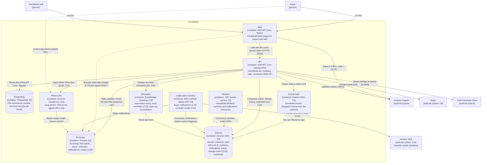

# Containers (C4 level 2)

```mermaid
flowchart TB
  buyer["Buyer<br/>[person]"]
  staff["HomeBuild staff<br/>[person]"]

  subgraph homebuild [HomeBuild]
    web["Web<br/>[container: ASP.NET Core, Blazor]<br/>HomeBuild.Web: pages for buyers and staff"]
    api["API<br/>[container: ASP.NET Core minimal APIs]<br/>HomeBuild.Api: modules, rules, versioned JSON API"]
    db[("PostgreSQL<br/>[container: PostgreSQL 19]<br/>One schema per module, row-level security per tenant")]
    s3[("S3 bucket<br/>[container: Amazon S3]<br/>incoming/, floor-plans/, diary/, contracts/, notifications/, snags/ (C10)")]
    workers["Workers<br/>[container: .NET worker service, C9]<br/>HomeBuild.Workers: contracts and notifications consumers"]
    lambda["Notifications function<br/>[container: AWS Lambda, Native AOT, C9]<br/>Buyer notifications to S3; reminder emails (C10)"]
    sns["Events topic<br/>[container: Amazon SNS, C9]<br/>homebuild-events: integration events from the outboxes"]
    sqs[("Queues<br/>[container: Amazon SQS, C9]<br/>one per consumer, each with a DLQ: contracts, notifications, extras, change-orders (C10), scheduled")]
    scheduler["Schedules<br/>[container: EventBridge Scheduler, C9]<br/>reservation expiry, snag reminders (C10), clean-up, reconciliation"]
    cdn["Photo CDN<br/>[container: Amazon CloudFront, C10]<br/>snag photos: OAC to S3, signed URLs only"]
  end

  cognito["Amazon Cognito<br/>[external system]"]
  stripe["Stripe<br/>[external system, C8]"]
  ses["Amazon SES<br/>[external system, C10]<br/>reminder emails (sandbox)"]
  ssm["SSM Parameter Store<br/>[external system]"]

  buyer -- "HTTPS" --> web
  staff -- "HTTPS" --> web
  web -- "Signs in (OIDC, code + PKCE)" --> cognito
  web -- "Calls with the user's access token (HTTPS, JSON)" --> api
  api -- "Validates tokens (JWKS)" --> cognito
  api -- "Reads and writes (EF Core, Npgsql)" --> db
  api -- "Signs uploads, moves checked files (assumed role)" --> s3
  web -. "Browser posts files straight to S3 (pre-signed POST)" .-> s3
  api -- "Reads settings at startup (in AWS)" --> ssm
  api -- "Charges cards (C8)" --> stripe
  api -- "Relays outbox events (C9)" --> sns
  sns -- "Fan-out, filtered by type" --> sqs
  api -- "Consumes extras, change-orders, scheduled (C9, C10)" --> sqs
  workers -- "Consumes contracts, writes PDFs" --> sqs
  lambda -- "Consumes notifications (event source mapping)" --> sqs
  lambda -- "Writes notifications/" --> s3
  lambda -- "Sends reminder emails (C10)" --> ses
  api -- "Creates one-time schedules (C9, C10)" --> scheduler
  scheduler -- "Sends due work" --> sqs
  api -- "Signs photo URLs (key group, C10)" --> cdn
  buyer -. "Loads snag photos (signed URL)" .-> cdn
  cdn -- "Reads snags/ (origin access control)" --> s3
```
