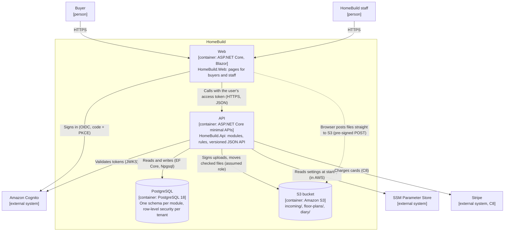

# Containers (C4 level 2)

```mermaid
flowchart TB
  buyer["Buyer<br/>[person]"]
  staff["HomeBuild staff<br/>[person]"]

  subgraph homebuild [HomeBuild]
    web["Web<br/>[container: ASP.NET Core, Blazor]<br/>HomeBuild.Web: pages for buyers and staff"]
    api["API<br/>[container: ASP.NET Core minimal APIs]<br/>HomeBuild.Api: modules, rules, versioned JSON API"]
    db[("PostgreSQL<br/>[container: PostgreSQL 18]<br/>One schema per module, row-level security per tenant")]
    s3[("S3 bucket<br/>[container: Amazon S3]<br/>incoming/, floor-plans/, diary/")]
  end

  cognito["Amazon Cognito<br/>[external system]"]
  stripe["Stripe<br/>[external system, C8]"]
  ssm["SSM Parameter Store<br/>[external system]"]

  buyer -- "HTTPS" --> web
  staff -- "HTTPS" --> web
  web -- "Signs in (OIDC, code + PKCE)" --> cognito
  web -- "Calls with the user's access token (HTTPS, JSON)" --> api
  api -- "Validates tokens (JWKS)" --> cognito
  api -- "Reads and writes (EF Core, Npgsql)" --> db
  api -- "Signs uploads, moves checked files (assumed role)" --> s3
  web -. "Browser posts files straight to S3 (pre-signed POST)" .-> s3
  api -- "Reads settings at startup (in AWS)" --> ssm
  api -- "Charges cards (C8)" --> stripe
```
