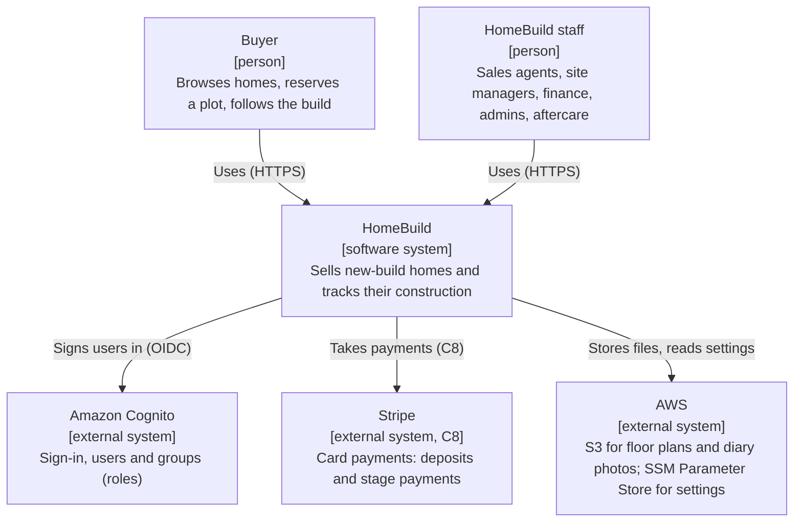

# System context (C4 level 1)

```mermaid
flowchart TB
  buyer["Buyer<br/>[person]<br/>Browses homes, reserves a plot, follows the build"]
  staff["HomeBuild staff<br/>[person]<br/>Sales agents, site managers, finance, admins, aftercare"]
  homebuild["HomeBuild<br/>[software system]<br/>Sells new-build homes and tracks their construction"]
  cognito["Amazon Cognito<br/>[external system]<br/>Sign-in, users and groups (roles)"]
  stripe["Stripe<br/>[external system, C8]<br/>Card payments: deposits and stage payments"]
  aws["AWS<br/>[external system]<br/>S3 for floor plans and diary photos; SSM Parameter Store for settings"]

  buyer -- "Uses (HTTPS)" --> homebuild
  staff -- "Uses (HTTPS)" --> homebuild
  homebuild -- "Signs users in (OIDC)" --> cognito
  homebuild -- "Takes payments (C8)" --> stripe
  homebuild -- "Stores files, reads settings" --> aws
```
